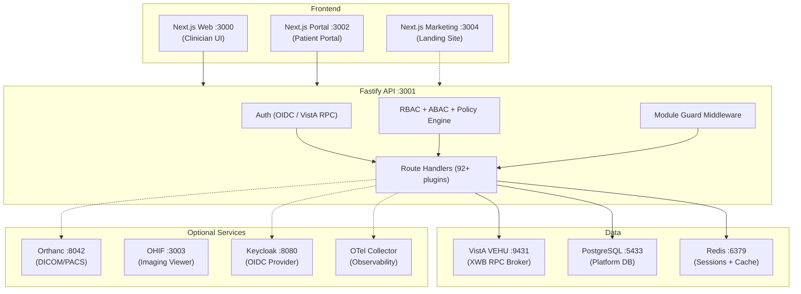

# VistA Evolved -- System Architecture

## Overview

VistA Evolved is a full-stack TypeScript platform that modernizes the US
Department of Veterans Affairs VistA EHR. Every clinical operation flows
through real VistA RPC calls -- no shadow databases, no mock data.



## Core Layers

### 1. VistA Layer (MUMPS/YottaDB)

The clinical brain. VistA stores all patient data in hierarchical globals
and exposes operations via the XWB RPC Broker protocol.

- **14 custom ZVE* M routines** expose admin functionality not natively available
- **340+ RPCs** registered in `rpcRegistry.ts`
- **XWB protocol client** in `rpcBrokerClient.ts` with cipher pads, connection pooling
- **Circuit breaker** via `rpc-resilience.ts` (5 failures -> open, 30s half-open)

### 2. API Layer (Fastify + TypeScript)

The gateway between modern web clients and VistA. Handles authentication,
authorization, data transformation, and multi-tenant isolation.

Key subsystems:
- **Auth**: OIDC (Keycloak), VistA RPC auth, session cookies, CSRF synchronizer tokens
- **Security**: Default-deny policy engine (~40 actions), RBAC, ABAC, PHI redaction
- **RCM**: 9-state claim lifecycle, X12 5010, PhilHealth eClaims, 8+ payer connectors
- **Interop**: FHIR R4 gateway (7 resources), HL7v2 engine (MLLP, ADT/ORU/SIU)
- **Modules**: 14 system modules, 7 SKU profiles, DB-backed entitlements
- **Provisioning**: PG-backed tenant lifecycle with 8-step pipeline
- **Telemetry**: OpenTelemetry tracing, Prometheus metrics, structured logging

### 3. Web Layer (Next.js + React)

Two separate Next.js applications:

- **apps/web** (port 3000): Clinician-facing CPRS-equivalent with tabbed chart panels
- **apps/portal** (port 3002): Patient-facing portal with independent auth, kiosk mode

### 4. Data Layer

| Store | Purpose | Persistence |
| ----- | ------- | ----------- |
| VistA (YottaDB) | Clinical data | Permanent (Docker volume) |
| PostgreSQL | Platform data (tenants, audit, RCM, sessions) | Permanent |
| Redis | Session cache, rate limiting, pub/sub | Ephemeral |
| In-memory Maps | Hot caches (capability, RPC results) | Ephemeral |

## Module Architecture

14 system modules registered in `config/modules.json`:

| Module | Description | Key Routes |
| ------ | ----------- | ---------- |
| kernel | Core platform (auth, audit, DB) | /auth/*, /health |
| clinical | CPRS clinical workflows | /vista/*, /cprs/* |
| portal | Patient portal | /portal/* |
| telehealth | Video visits (Jitsi) | /telehealth/* |
| imaging | DICOM/PACS (Orthanc) | /imaging/* |
| analytics | BI dashboards, ROcto SQL | /analytics/* |
| interop | FHIR R4, HL7v2 | /fhir/*, /hl7/* |
| intake | AI-assisted patient intake | /intake/* |
| ai | Clinical decision support | /cds/* |
| iam | Identity & access management | /iam/* |
| rcm | Revenue cycle management | /rcm/* |
| scheduling | VistA SDES scheduling | /scheduling/* |
| admin | System administration | /admin/* |
| infrastructure | Observability, backup | /posture/*, /metrics |

## Security Architecture

- **Authentication**: OIDC (Keycloak) for production, VistA RPC auth for dev
- **Authorization**: RBAC (role -> permissions) + ABAC (attribute conditions)
- **Session**: httpOnly cookies, CSRF synchronizer tokens, device fingerprinting
- **Audit**: SHA-256 hash-chained immutable audit trail (3 chains: general, imaging, RCM)
- **PHI Protection**: `sanitizeAuditDetail()` strips all PHI before logging
- **Encryption**: Envelope encryption (AES-256-GCM) with key rotation
- **Multi-tenant**: RLS on 100+ PG tables, FORCE RLS in rc/prod mode

## VistA Admin Domains (12)

All 12 VistA administration domains are implemented with custom M routines,
API routes, and React UI pages:

1. System Infrastructure (ZVESYS.m)
2. Facility Setup (ZVEFAC.m)
3. Clinic Setup (ZVECLIN.m)
4. Inpatient/Wards (ZVEWARD.m + ZVEADT.m)
5. Pharmacy (ZVEPHAR.m)
6. Laboratory (ZVELAB.m)
7. Radiology (ZVERAD.m)
8. Billing/Revenue (ZVEBILL.m + RCM module)
9. Inventory/IFCAP (ZVEINV.m)
10. Workforce (ZVEWRKF.m)
11. Quality/Compliance (ZVEQUAL.m)
12. Clinical App Setup (ZVECAPP.m)

## Deployment

### Development (VEHU Lane)

```powershell
.\scripts\dev-up.ps1 -RuntimeLane vehu
```

### Runtime Modes

| Mode | PG Required | RLS | OIDC | SQLite |
| ---- | ----------- | --- | ---- | ------ |
| dev | No | Off | Optional | Allowed |
| test | No | Off | Optional | Allowed |
| rc | Yes | Auto | Required | Blocked |
| prod | Yes | Forced | Required | Blocked |

Set via `PLATFORM_RUNTIME_MODE` env var.

## Key Files

| File | Purpose |
| ---- | ------- |
| AGENTS.md | AI agent and developer onboarding (190+ rules) |
| config/modules.json | Module definitions |
| config/skus.json | SKU deploy profiles |
| config/capabilities.json | 50+ capability definitions |
| config/entity-types.json | Healthcare org entity types |
| apps/api/src/vista/rpcRegistry.ts | 340+ RPC registrations |
| apps/api/src/platform/pg/pg-migrate.ts | 64 PG migrations |
| scripts/dev-up.ps1 | Canonical dev startup |
| scripts/verify-rc.ps1 | Release candidate verification |
